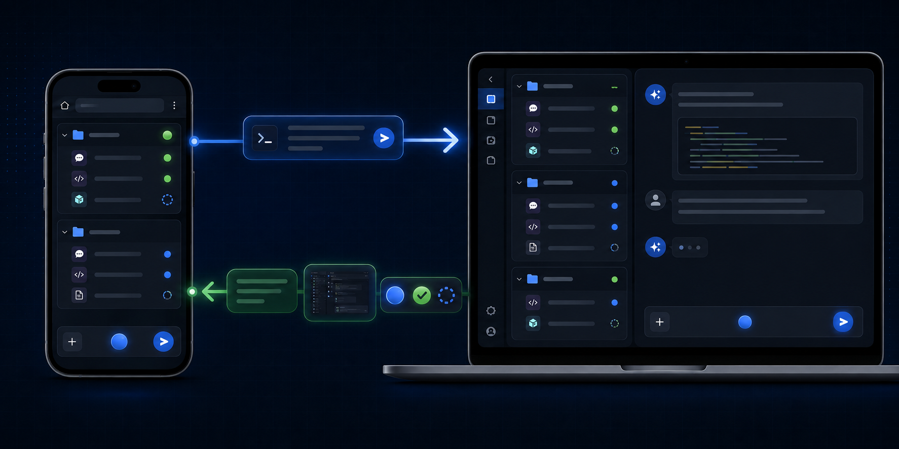

# CodeAway



CodeAway is a thin, browser-based remote control for local AI coding agents.
Version 0.1 supports one pairing only: **Windows with Codex Desktop**. The
source repository is `codeaway2`; the Python package and command are
`codeaway`.

> Status: MVP implementation complete; the live Windows/phone smoke test is
> still pending. The package is not published yet.

## Run CodeAway

The first run is laptop-only. Start CodeAway in the foreground:

```powershell
uvx codeaway
```

It listens on `127.0.0.1:8765` and opens `/setup` in the laptop browser. Choose
the visible Codex Desktop window and draw all three capture regions:

- **Sidebar:** the projects and tasks on the left.
- **Conversation:** the right pane above the input.
- **Composer:** the chat box only; it may grow taller. Do not include the
  full-width toolbar or status row.

To enable phone access, restart with an address assigned to the laptop on your
LAN or Tailscale network:

```powershell
uvx codeaway --ip <IPv4-LAN-or-Tailscale-address>
```

The explicit address is saved only after it binds successfully. Later
`uvx codeaway` launches reuse both that address and the saved calibration. If
the saved Codex window and all three regions resolve, CodeAway prints the phone
workspace URL without opening a laptop browser. The phone workspace still
links to `/setup` when recalibration is needed.

If a cached address is no longer available, CodeAway warns, falls back to
`127.0.0.1`, and saves that fallback. An invalid explicit address exits instead
of silently changing interfaces. Use `--no-browser` to suppress an otherwise
necessary setup launch and `--port PORT` to select and cache another port.
CodeAway v0.1 accepts IPv4 literals only; IPv6 addresses are rejected with an
actionable startup error.

> **Security:** A non-loopback endpoint grants full desktop mouse and keyboard
> input control to every device that can reach it. CodeAway v0.1 has no pairing
> or authentication, so expose it only on a network boundary you trust.

## Architecture

CodeAway deliberately separates two independent backend axes:

| Module | Backends | Responsibility |
| --- | --- | --- |
| `agents.py` | Codex first; Claude Code and Cursor later | Owns application semantics: detection, projects and tasks, navigation, calibrated surfaces, and actions |
| `desktop.py` | Windows first; macOS and Linux later | Owns OS mechanics: windows, screenshots, accessibility, mouse, keyboard, and clipboard operations |

The server composes one agent backend with one desktop backend. For the first
release that pair is Codex Desktop on Windows. Agent backends do not contain
Windows APIs, and desktop backends do not contain Codex-specific behavior.
